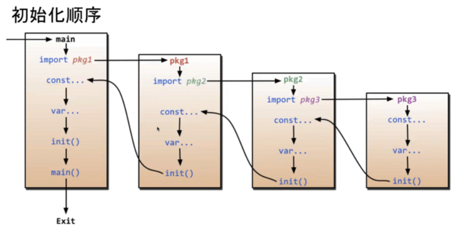

# Go语言基础必备知识点(九) 包(package)、init函数、go mod篇

# 1. 包 (package)

Go语言是使用包来组织源代码的，包 (package) 是多个 Go 源码的集合，是一种高级的代码复用方案

*Go语言中为我们提供了很多内置包，如 fmt、os、io 等*

任何源代码文件必须属于某个包，同时源码文件的第一行有效代码必须是 `package packageName` 语句，通过该语句声明自己所在的包

## 1.1 包的基本概念

Go语言的包借助了目录树的组织形式，一般包的名称就是其**源文件所在目录**的名称，虽然Go语言没有强制要求包名必须和其所在的目录名同名，但还是**建议包名和所在目录同名**，这样结构更清晰

包可以定义在很深的目录中，包名的定义是不包括目录路径的，但是包在引用时一般使用**全路径引用**

包的习惯用法：

- 包名一般是小写的，使用一个简短且有意义的名称
- 包名一般要和所在的目录同名，也可以不同，包名中不能包含`- `等特殊符号
- **包名为 main 的包为应用程序的入口包，编译不包含 main 包的源码文件时不会得到可执行文件**
- 一个文件夹下的所有源码文件只能属于同一个包，同样属于同一个包的源码文件不能放在多个文件夹下

## 1.2 包的导入

要在代码中引用其他包的内容，需要使用 import 关键字导入使用的包。具体语法如下：

```go
import "包的路径"
```

注意事项：

- import 导入语句通常放在源码文件开头包声明语句的下面
- 导入的包名需要使用**双引号**包裹起来

包的导入有两种写法，分别是单行导入和多行导入

**单行导入**

```go
import "包 1 的路径"
import "包 2 的路径"
```

**多行导入**

```go
import (
    "包 1 的路径"
    "包 2 的路径"
)
```

## 1.3 包的导入路径

**包的绝对路径就是 `GOROOT/src/` 或 `GOPATH` 后面包的存放路径，如下所示：**

```go
import "lab/test"
import "database/sql/driver"
import "database/sql"
```

上面代码的含义如下：

- test 包是自定义的包，其源码位于 `GOPATH/lab/test` 目录下
- driver 包的源码位于 `GOROOT/src/database/sql/driver` 目录下
- sql 包的源码位于 `GOROOT/src/database/sql` 目录下

## 1.4 包的引用格式

包的引用有四种格式，下面以 fmt 包为例来分别演示一下这四种格式。

1. 标准引用格式

   ```go
   import "fmt"
   ```

   此时可以用`fmt.`作为前缀来使用 fmt 包中的方法，这是常用的一种方式

   ```go
   package main

   import "fmt"

   func main() {
       fmt.Println("Chris Liu")
   }
   ```

2. 自定义别名引用格式

   在导入包的时候，我们还可以为导入的包设置别名，如下所示：

   ```go
   import F "fmt"
   ```

   其中 F 就是 fmt 包的别名，使用时我们可以使用`F.`来代替标准引用格式的`fmt.`来作为前缀使用 fmt 包中的方法

   ```go
   package main

   import F "fmt"

   func main() {
       F.Println("Chris Liu")
   }
   ```

3. 省略引用格式

   ```go
   import . "fmt"
   ```

   这种格式相当于把 fmt 包直接合并到当前程序中，在使用 fmt 包内的方法是可以不用加前缀`fmt.`，直接引用

   ```go
   package main

   import . "fmt"

   func main() {

       //不需要加前缀 fmt.
       Println("Chris Liu")
   }
   ```

4. 匿名引用格式

   在引用某个包时，如果只是希望执行包初始化的 init 函数，而不使用包内部的数据时，可以使用匿名引用格式，如下所示：

   ```go
   import _ "fmt"
   ```

   匿名导入的包与其他方式导入的包一样都会被编译到可执行文件中

   使用标准格式引用包，但是代码中却没有使用包，编译器会报错
   
   如果包中有 init 初始化函数，则通过`import _ "包的路径" `这种方式引用包，仅执行包的初始化函数，即使包没有 init 初始化函数，也不会引发编译器报错

   ```go
   package main
   import (
       _ "database/sql"
       "fmt"
   )
   func main() {
       fmt.Println("Chris Liu")
   }
   ```

**注意：**

- 一个包可以有多个 init 函数，包加载时会执行全部的 init 函数，但并不能保证执行顺序，所以不建议在一个包中放入多个 init 函数，将需要初始化的逻辑放到一个 init 函数里面
- 包不能出现**环形引用**的情况，比如包 a 引用了包 b，包 b 引用了包 c，如果包 c 又引用了包 a，则编译不能通过
- 包的**重复引用**是允许的，比如包 a 引用了包 b 和包 c，包 b 和包 c 都引用了包 d。这种场景相当于重复引用了 d，这种情况是允许的，并且 Go 编译器**保证包 d 的 init 函数只会执行一次**

# 2. init函数

Go 语言中 init 函数用于包 (package) 的初始化，该函数是 Go 语言的一个重要特性

## 2.1 init函数的特性

* init 函数先于 main 函数自动执行
* 每个包中可以有多个 init 函数，每个包中的源文件中也可以有多个 init 函数
* init 函数没有输入参数、返回值，也未声明，所以无法引用
* 不同包的 init 函数按照包导入的依赖关系决定执行顺序
* 无论包被导入多少次，init 函数只会被调用一次，也就是只执行一次

## 2.2 init函数的执行顺序



这张图片很清晰的反应了init函数的加载顺序：

* 包加载优先级排在第一位，先层层递归进行包加载
* 每个包中加载顺序为：const > var > init，首先进行初始化的是常量，然后是变量，最后才是init函数

**一句话总结：**

从当前包开始，如果当前包包含多个依赖包，则先初始化依赖包，层层递归初始化各个包，在每一个包中，按照源文件的字典序从前往后执行，每一个源文件中，优先初始化常量、变量，最后初始化init函数，当出现多个init函数时，则按照顺序从前往后依次执行，每一个包完成加载后，递归返回，最后再初始化当前包！

## 2.3 init函数的使用场景

init 函数的使用场景还是挺多的，比如进行服务注册、进行数据库或各种中间件的初始化连接等

Go 的标准库中也有许多地方使用到了 init 函数，比如经常使用的 pprof 工具就使用到了 init 函数，在 init 函数里面进行路由注册：

```go
//go/1.15.7/libexec/src/cmd/trace/pprof.go

func init() {
    http.HandleFunc("/io", serveSVGProfile(pprofByGoroutine(computePprofIO)))
    http.HandleFunc("/block", serveSVGProfile(pprofByGoroutine(computePprofBlock)))
    http.HandleFunc("/syscall", serveSVGProfile(pprofByGoroutine(computePprofSyscall)))
    http.HandleFunc("/sched", serveSVGProfile(pprofByGoroutine(computePprofSched)))

    http.HandleFunc("/regionio", serveSVGProfile(pprofByRegion(computePprofIO)))
    http.HandleFunc("/regionblock", serveSVGProfile(pprofByRegion(computePprofBlock)))
    http.HandleFunc("/regionsyscall", serveSVGProfile(pprofByRegion(computePprofSyscall)))
    http.HandleFunc("/regionsched", serveSVGProfile(pprofByRegion(computePprofSched)))
}
```

# 3. *go mod

go module 是 Go 语言从 1.11 版本之后官方推出的**版本管理**工具，并且从 Go 1.13 版本开始，go module 成为了 Go 语言默认的依赖管理工具

Modules 官方定义为：

> Modules 是相关 Go 包的集合，是源代码交换和版本控制的单元
> Go语言命令直接支持使用 Modules，包括记录和解析对其他模块的依赖性Modules 替换旧的基于 GOPATH 的方法，来指定使用哪些源文件

Go 最新版本使用 go module 已经不需要设置环境变量

**go mod 有以下命令：**

| 命令     | 说明                                                         |
| -------- | ------------------------------------------------------------ |
| download | download modules to local cache(下载依赖包)                  |
| edit     | edit go.mod from tools or scripts (编辑go.mod)               |
| graph    | print module requirement graph (打印模块依赖图)              |
| init     | initialize new module in current directory (在当前目录初始化mod)  |
| tidy     | add missing and remove unused modules(拉取缺少的模块，移除不用的模块) |
| vendor   | make vendored copy of dependencies(将依赖复制到vendor下)     |
| verify   | verify dependencies have expected content (验证依赖是否正确)  |
| why      | explain why packages or modules are needed(解释为什么需要依赖) |

- 常用的有 `init tdiy edit`

**使用go get命令下载指定版本的依赖包：**

执行`go get `命令，在下载依赖包的同时还可以指定依赖包的版本

- 运行`go get -u`命令会将项目中的包升级到最新的次要版本或者修订版本
- 运行`go get -u=patch`命令会将项目中的包升级到最新的修订版本
- 运行`go get [包名]@[版本号]`命令会下载对应包的指定版本或者将对应包升级到指定的版本

> 提示：
> `go get [包名]@[版本号]`命令中版本号
> 可以是 x.y.z 的形式，例如 go get foo@v1.2.3
> 也可以是 git 上的分支或 tag，例如 go get foo@master
> 还可以是 git 提交时的哈希值，例如 go get foo@e3702bed2

## 3.1 项目中使用

1. 在 GOPATH 目录下新建一个目录，并使用`go mod init`初始化生成 go.mod 文件

   go.mod 文件一旦创建后，它的内容将会被 go toolchain 全面掌控，go toolchain 会在各类命令执行时，比如`go get`、`go build`、`go mod`等修改和维护 go.mod 文件

   go.mod 提供了 module、require、replace 和 exclude 四个命令：

   - module 语句指定包的名字 (路径)
   - require 语句指定的依赖项模块
   - replace 语句可以替换依赖项模块
   - exclude 语句可以忽略依赖项模块

   初始化生成的 go.mod 文件如下所示：

   ```go
   module mypro
   
   go 1.19
   ```

2. 添加依赖

   新建一个 main.go 文件，写入以下代码：

   ```go
   package main
   import (
       "net/http"
       "github.com/labstack/echo"
   )
   func main() {
       e := echo.New()
       e.GET("/", func(c echo.Context) error {
           return c.String(http.StatusOK, "Hello, World!")
       })
       e.Logger.Fatal(e.Start(":1323"))
   }
   ```

   执行`go mod tidy`运行代码会发现 go mod 会自动查找依赖自动下载

   ```go
   go: finding module for package github.com/labstack/echo
   go: found github.com/labstack/echo in github.com/labstack/echo v3.3.10+incompatible
   go: finding module for package github.com/stretchr/testify/assert
   go: finding module for package github.com/labstack/gommon/log
   go: finding module for package github.com/labstack/gommon/color
   go: finding module for package golang.org/x/crypto/acme/autocert
   go: found github.com/labstack/gommon/color in github.com/labstack/gommon v0.3.1
   go: found github.com/labstack/gommon/log in github.com/labstack/gommon v0.3.1
   go: found golang.org/x/crypto/acme/autocert in golang.org/x/crypto v0.0.0-20220112180741-5e0467b6c7ce
   go: found github.com/stretchr/testify/assert in github.com/stretchr/testify v1.7.0
   ```

   go.mod中的内容：

   ```go
   module mypro
   
   go 1.19
   
   require github.com/labstack/echo v3.3.10+incompatible
   
   require (
   	github.com/labstack/gommon v0.3.1 // indirect
   	github.com/mattn/go-colorable v0.1.11 // indirect
   	github.com/mattn/go-isatty v0.0.14 // indirect
   	github.com/valyala/bytebufferpool v1.0.0 // indirect
   	github.com/valyala/fasttemplate v1.2.1 // indirect
   	golang.org/x/crypto v0.0.0-20220112180741-5e0467b6c7ce // indirect
   	golang.org/x/net v0.0.0-20211112202133-69e39bad7dc2 // indirect
   	golang.org/x/sys v0.0.0-20211103235746-7861aae1554b // indirect
   	golang.org/x/text v0.3.6 // indirect
   )
   
   ```

   **go module 安装 package 的原则是先拉取最新的 release tag，若无 tag 则拉取最新的 commit**

   go 会自动生成一个 go.sum 文件来记录 dependency tree

   执行脚本`go run main.go`，就可以运行项目

   可以使用命令`go list -m -u all`来检查可以升级的 package，使用`go get -u need-upgrade-package`升级后会将新的依赖版本更新到 go.mod

   比如：`go get -u github.com/labstack/gommon`

   也可以使用`go get -u`升级所有依赖

3. 一般使用包之前，是首先执行`go get`命令，先下载依赖
   比如 `github.com/labstack/echo`

**使用 replace 替换无法直接获取的 package：**

由于某些已知的原因，并不是所有的 package 都能成功下载，比如：golang.org 下的包

modules 可以通过在 go.mod 文件中使用 replace 指令替换成 github 上对应的库，比如：

```go
replace (
    golang.org/x/crypto v0.0.0-20190313024323-a1f597ede03a => github.com/golang/crypto v0.0.0-20190313024323-a1f597ede03a
)
```

或者

```go
replace golang.org/x/crypto v0.0.0-20190313024323-a1f597ede03a => github.com/golang/crypto v0.0.0-20190313024323-a1f597ede03a
```

> `go install`命令将项目打包安装为可执行文件，在安装在GOPATH的bin目录下，go install执行的项目 必须有main方法