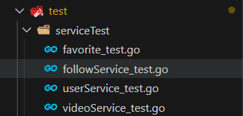

# Go语言工程实践之测试

## 1. 单元测试  

**保证质量、提升效率**

输入-->测试单元-->输出-->校对
期望--------------------------->校对


1. 单元测试-规则  

    * 所有测试文件以`_test.go`结尾  
      
    * `func TestXxx(*testing.T)`
    * 初始化逻辑放到`TestMain`中

2. 运行 
   
    ~~~go
    go test[flags][packages]
    ~~~
    
3. assert包
    
    ~~~go
    import (
        "github.com/stretchr/testify/assert"
        "testing"
    )
    
    func TestHelloTom(t *testing.T) {
        output := HelloTom()
        expectOutput := "Tom"
        assert.Equal(t, expectOutput, output)
    }
    ~~~

    ```
    RUN TestHelloTom
    PASS
    ```

4. 代码覆盖率
    
   如何衡量代码是否经过了足够的测试？

   如何评价项目的测试水准？

    ```go
    func JudgePassLine(score int16) bool {
        if score >= 60 {
            return true
        }
        return false
    }
    ```

    测试代码：

    ```go
    func TestJudgePassLineTrue(t *testing.T) {
        isPass := JudgePassLine(score: 70)
        assert.Equal(t, expected: true, isPass)
    }
    ```
    覆盖率: --cover 显示coverage的比例 (测试到的代码比例)
    
    ```
    -> test git:(V0) × go test judgment_test.go judgment.go --cover
    ok command-line-arguments (cached) coverage: 66.7% of statements
    ```

    只测试到了 `if score >= 60 {
            return true
        }`两条语句
    
    没有测试`return false`一条语句
    所以是覆盖率66.7%


    提高单元测试覆盖率代码：

    ```go
    func TestJudgePassLineTrue(t *testing.T) {
        isPass := JudgePassLine(score: 70)
        assert.Equal(t, expected: true, isPass)
    }
    
    func TestJudgePassLineFail(t *testing.T) {
        isPass := JudgePassLine(score: 50)
        assert.Equal(t, expected: false, isPass)
    }
    ```

    控制台输出：

    ```
    -> test git:(V0) × go test judgment_test.go judgment.go --cover
    ok command-line-arguments (cached) coverage: 100.0% of statements
    ```

Tips：

   * 一般覆盖率:50% ~ 60%(可覆盖整体基本逻辑)，较高覆盖率80%+(支付流程等)
   * 测试分支相互独立、全面覆盖
   * 测试单元粒度足够小，函数单一职责

5. 单元测试-依赖

   外部依赖 => 稳定&幂等

## 2. Mock测试

Mock 测试就是在测试过程中，对于某些不容易构造或者不容易获取的比较复杂的对象（如 JDBC 中的ResultSet 对象），用一个虚拟的对象（Mock 对象）来创建以便测试的测试方法

**Mock既能出现在单元测试中，也会出现在集成测试、系统测试过程中**

   快速Mock函数
   * 为一个函数打桩
   * 为一个方法打桩

打桩测试，不再依赖本地文件
   
## 3. 基准测试  

基准测试是指通过设计科学的测试方法、测试工具和测试系统，实现对一类测试对象的某项性能指标进行定量的和可对比的测试

简单来说，基准测试是为了评估测试目标的**性能**采取的一系列行动，包括运行一个或一组程序或者执行其他的操作

基准测试在我们生活中无处不在，比如“不服跑个分”，其中的“跑分”指的就是基准测试。类似的还有网速测试、Online Judge 的评测结果等等

   

1. 基准测试-运行
   
   * 优化代码，需要对当前代码分析
   * 内置的测试框架提供了基准测试的能力
   (有时候测试一些性能在本地比较方便)
   * 入参`func TestXxx(*testing.B)`

2. 优化 
   使用`fastrand`
   `fastrand.Intn(n: 10)`

   几乎所有开发都知道，如果要测量程序的性能，就需要性能测试

   性能测试包含了两种：压力测试和基准测试
   
   前者是针对接口 API，模拟大量用户去访问接口然后生成接口级别的性能数据；而后者是针对代码，可以用来测试某一段代码的运行速度，例如一个排序算法