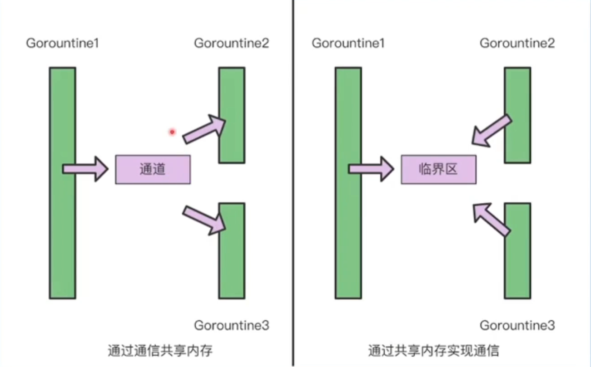
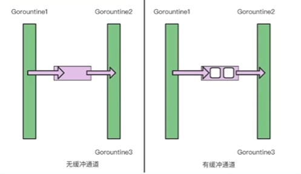
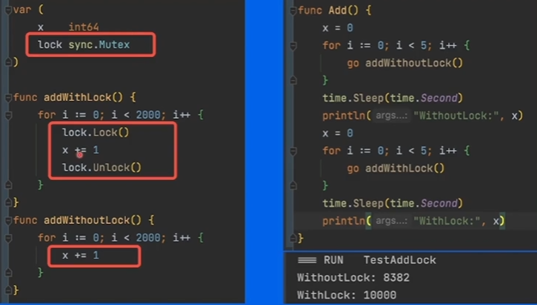
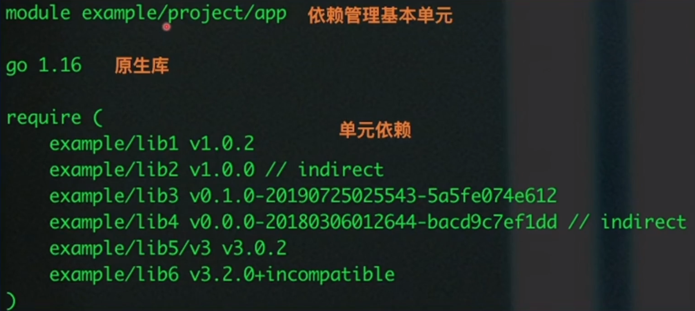

# Go语言进阶与依赖管理

## 1. 语言进阶

**从并发编程的视角了解Go高性能的本质**

1. Goroutine  

    * 协程：用户态，轻量级线程，**栈KB级别**
    * 线程：内核态，线程跑多个协程，**栈MB级别**

    **快速**打印hello goroutine : 0 ~ hello goroutine : 4
    ```go
    func hello(i int) {
        println("hello goroutine:" + fmt.Sprint(i))
    }

    func HelloGoRoutine() {
        for i := 0; i < 5; i++ {
            go func(j int) {    //func前加go关键字增加协程
                hello(j)
            }(i)
        }
        time.Sleep(time.Second)  //子协程执行完主协程不退出(可优化)
    }
    ```
    OUTPUT : (乱序输出)

    ```
    [Running] go run "c:\Users\DELL\Desktop\mypro\掘金文档\test.go"
    hello goroutine:4
    hello goroutine:0
    hello goroutine:2
    hello goroutine:1
    hello goroutine:3
    ```

2. CSP (Communicating Sequential Processes)
   
   提倡通过**通信共享内存**而不是通过共享内存而实现通信

3. Channel
    `make(chan 元素类型,[缓冲大小])`

    * 无缓冲通道  `make(chan int)`
    * 有缓冲通道  `make(chan int，2)//通道容量为2`

    

    无缓冲通道也被称为同步通道

    能保证运行顺序，是并发安全的
    
4. 并发安全Lock

   Sync包下的关键字

   对变量执行2000次+1操作，5个协程并发执行:

   

   并发安全问题，未加锁会输出无法预知的值
5. WaitGroup
   
   Sync包下的关键字，作用类比Sleep，是更优雅的方式

   * `Add(delta int)` 计数器+delta
   * `Done()` 计数器-1
   * `Wait()` 阻塞直到计数器为0

   **计数器**

   开启协程+1；执行结束-1；主协程阻塞直到计数器为0(所有任务都已完成)
   
## 2.依赖管理

* 工程项目不可能基于标准库0 ~ 编码搭建(应多关注业务逻辑)
* 管理依赖库


1. Go依赖管理演进
   
   GOPATH -> Go Vendor -> Go Module
   
   * 不同环境(项目)依赖的版本不同
   * 控制依赖库的版本

2. GOPATH
   * 环境变量`$GOPATH`
   
   * 项目代码直接依赖src下的代码
   * go get下载最新版本的包到src目录下

   GOPATH-弊端

   无法实现package的多版本控制
3. Go Vendor
   
   * 项目项目目录下增加vendor文件，所有依赖包副本形式放在`$ProjectRoot/vendor`
   * 依赖寻址方式:vendor => GOPATH

   通过每个项目引入一份依赖的副本，解决了多个项目需要同一个package依赖的冲突问题

   Go Vendor-弊端

   * 无法控制依赖的版本
   * 更新项目又可能出现依赖冲突，导致编译出错
4. **Go Module**
   
   * 通过`go.mod`文件管理依赖包版本
   * 通过`go get/go mod`指令工具管理依赖包
   
   **终极目标**：定义版本规则和管理项目依赖关系

5. **依赖管理三要素**
   
   1. 配置文件，描述依赖  `go.mod`
   2. 中心仓库管理依赖库  `Proxy`
   3. 本地工具  `go get/mod`
   (类比Java的Maven)

6. 依赖配置-go.mod
   
   依赖标识：[Module Path][Version/Pseudo-version]

7. 依赖配置-version
   
   语义化版本：

    `${MAJOR}.${MINOR}.${PATCH}`

    * V1.3.0

    * V2.3.0

    基于commit伪版本：(提交后都默认生成伪版本)

    `vX.0.0-yyyymmddhhmmss-abcdefgh1234` (版本-时间戳-12位提交哈希码前缀)

    * v0.0.0-20220401081311-c38fb59326b7

    * v1.0.0-20201130134442-10cb98267c6c

8. 依赖配置-indirect
   
   A -> B -> C
   * A -> B 直接依赖
   * A -> C 间接依赖

9. 依赖配置-incompatible
    
    * 主版本2+模块会在模块路径增加/vN后缀。
    * 对于没有go.mod文件并且主版本2+的依赖，会+incompatible
  
10. 依赖分发-回源
    
    * **无法保证构建稳定性**
      增加/修改/删除软件版本
    * **无法保证依赖可用性**
      删除软件
    * **增加第三方压力**
      代码托管平台负载问题

11. 依赖分发-Proxy
    
    变量GOPROXY

    GOPROXY="https://proxy1.cn,https://proxy2.cn ,direct”服务站点URL列表,“direct”表示源站

    Proxy1 -> Proxy2 -> direct

12. 工具-go get
    
    `go get example.org/pkg`:
    * @update 默认
    * @none 删除依赖
    * @v1.1.2 tag版本，语义版本
    * @23dfdd5 特定的commit
    * @master 分支的最新commit

12. 工具-go mod
    
    `go mod`:
    * init 初始化，创建go.mod文件(项目开始前的必须步骤)
    * download 下载模块到本地缓存(把所有文件拉下来)
    * tidy 增加需要的依赖，删除不需要的依赖