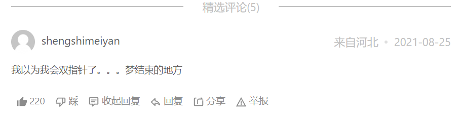

## *844.比较含退格的字符串

*[LeetCode链接](https://leetcode.cn/problems/backspace-string-compare/)*



### 题目大意

给 2 个字符串，如果遇到 # 号字符，就回退一个字符，问最终的 2 个字符串是否完全一致

注意：

* 如果对空文本输入退格字符，文本继续为空
* 1 <= s.length, t.length <= 200
* s 和 t 只含有小写字母以及字符 '#'

***进阶：**

你可以用 O(n) 的时间复杂度和 O(1) 的空间复杂度解决该问题吗？

答：双指针！可以维护两个计数器，记录下退格的个数，然后**倒序遍历**字符串来决定当前字符是否需要跳过，可能有些抽象

### 解题思路

**思路1：栈**

可以用栈的思想来模拟，遇到 '#' 字符就回退一个字符，不是 '#' 号就入栈一个字符，比较最终两个字符串即可。该思路需要定义两个切片模拟栈，空间复杂度O(n)

**思路2：双指针 (进阶)**

一个字符是否会被删掉，只取决于该字符后面的退格符，而与该字符前面的退格符无关。因此当我们**逆序**地遍历字符串，就可以立即确定当前字符是否会被删掉

具体地，我们定义 skip 表示当前待删除的字符的数量，每次我们遍历到一个字符

* 若该字符为退格符 '#'，则我们需要多删除一个普通字符，我们让 skip 加 1

* 若该字符为普通字符：

  * 若 skip 为 0，则说明当前字符不需要删去

  * 若 skip 不为 0，则说明当前字符需要删去，我们让 skip 减 1

这样，我们定义两个指针，分别指向两字符串的末尾。每次我们让两指针逆序地遍历两字符串，直到两字符串能够各自确定一个字符，然后将这两个字符进行比较。重复这一过程**直到找到的两个字符不相等**，或**遍历完字符串**为止，该思路不需要额外存储空间，空间复杂度O(1)

### 代码实现

#### **思路1：栈**

```go
func backspaceCompare(s string, t string) bool {
    return build(s) == build(t)
}
// 新建一个build函数，内部实现函数创建
func build(str string) string {
    s := make([]byte, 0)     // 用str[i]索引时用byte类型，直接索引v用rune
    // s := []byte{}         // 官方题解的写法
    // s := make([]rune, 0)  // 此处用rune时，第11行报错：cannot use str[i] (type byte) as type rune in append (solution.go)
    for i := range str {     // 省略索引值，只使用索引i的for range写法，s要定义为byte
        if str[i] != '#' {
            s = append(s, str[i])
        } else if len(s) > 0 {
            s = s[:len(s)-1]  // 相当于 s 出栈一个元素 (字符)
        } 
    }
    /* 另一种省略索引的for range写法，s要定义为rune
    for _, v := range str {
        if v != '#' {
            s = append(s, v)
        } else if len(s) > 0 {
            s = s[:len(s)-1]
        }
    } */
    return string(s) // byte 类型强转为 string
}
```

```go
注意：
1. byte和rune类型：用str[i]索引时用byte类型，直接索引v用rune
2. for range的两种写法：for i := range str 和 for _, v := range str
3. s = s[:len(s)-1]  // 相当于 s 出栈一个元素
```

> rune是Go语言中一种特殊的数据类型，它是int32的别名，几乎在所有方面等同于int32，用于区分字符值和整数值
>当需要处理中文、日文或者其他复合字符时，需要用到rune类型

> **补充：Go中的字符有两种，uint8 (byte) 代表 ASCII 的一个字符，rune代表一个 utf-8 字符**

#### **思路2：双指针**

```go
func backspaceCompare(s string, t string) bool {
    i, j := len(s)-1, len(t)-1
    skipS, skipT := 0, 0
    for i >= 0 || j >= 0 {  // 注意>=
        for i >= 0 {
            if s[i] == '#' {
                skipS++
                i--       // 忘记写i--，导致遇到 '#' 循环一直无法终止，导致runtime error
            } else if skipS > 0 {
                skipS--
                i--
            } else {
                break     // 不加break会继续循环，不会跳出
            }
        }
        for j >= 0 {
            if t[j] == '#' {
                skipT++        
                j--       // 忘记写j--，导致遇到 '#' 循环一直无法终止，导致runtime error
            } else if skipT > 0 {
                skipT--
                j--
            } else {
                break     // 不加break会继续循环，不会跳出
            }
        }
        if i >= 0 && j >= 0 {  // 注意 i，j都 >=，代表两个元素可以比较
            if s[i] != t[j] {
                return false
            } 
        } else if i >= 0 || j >= 0 {  // else if后用 ||，代表有一个<0，长度不等一定是false
            return false
        }
        i--
        j--                   // 注意在判断所有除了false的情况都需要i--， j--，所以写在if外
    }
    return true
}
```

```go
注意：
1. if s[i] == '#'的判断中忘记写i--，导致遇到'#'循环一直无法终止，报错runtime error
} 
2. 不加break会继续循环，不会跳出
3. 在判断所有除了false的情况都需要i--， j--，所以写在if外
```

### 复杂度分析

思路1 (栈实现)
* 时间复杂度：O(N+M) -> O(n)，其中 N 和 M 分别为字符串 s 和 t 的长度，我们需要遍历两字符串各一次

* 空间复杂度：O(N+M) -> O(n)，其中 N 和 M 分别为字符串 s 和 t 的长度，主要为还原出的字符串的开销

思路2 (双指针实现)

* 时间复杂度：O(N+M) -> O(n)，其中 N 和 M 分别为字符串 s 和 t 的长度，我们需要遍历两字符串各一次

* **空间复杂度：O(1)**，对于每个字符串，我们只需要定义一个指针和一个计数器即可