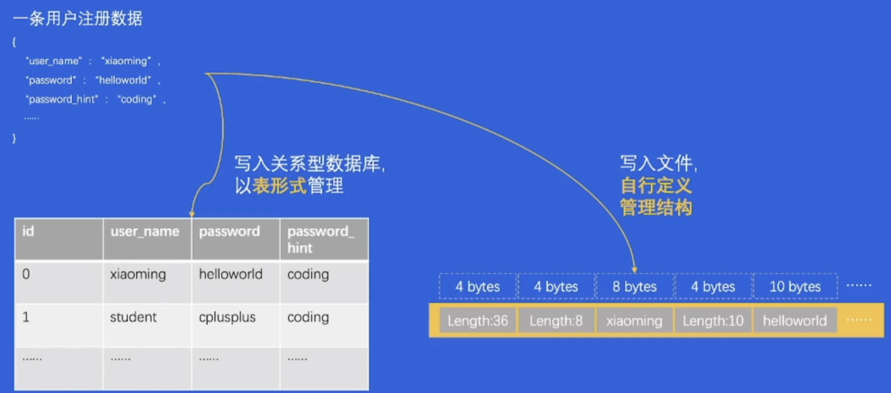
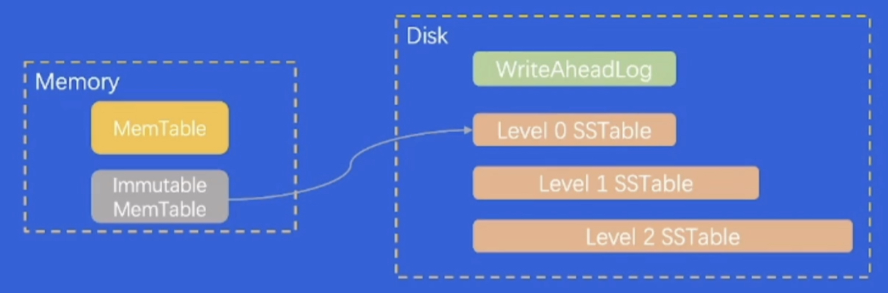

# 认识存储与数据库

## 1. 数据库-概览

**数据库和存储系统不一样吗？**

什么是存储系统？

一个提供了读写、控制类接口，能够安全有效地把数据持久化的软件，就可以成为存储系统

特点：

1.作为后端软件的底座，性能极其敏感

2.存储系统代码，既简单又复杂。对性能要求高，在I/O路径下一定不能太复杂，也不能太多分支，考虑多种异常情况，假设硬件会坏等

3.存储系统软件架构，容易受硬件影响。跟硬件打交道，磁盘等硬件设备，硬件发生变革时软件要顺应硬件的变革进行变革，甚至软件推倒重来

1. 关系型数据库 

    关系(Relation)又是什么？

    * 关系 = **集合** = 任意元素组成的若干有序偶对
      
      反映了事物间的关系
    * 关系代数 = 对关系作**运算的抽象查询语言**

      交、并、笛卡尔积......
    * SQL = 一种DSL (Domain Specific Language) (人说人话狗说狗话) = **方便人类阅读**的关系代数表达形式
    
2. 关系型数据库特点
   
   **关系型数据库是存储系统**，但是在存储之外，又发展出**其他能力**
   * 结构化数据友好
   * 支持事务 (ACID)
   * 支持复杂查询语言 (SQL全集、子集)

3. 非关系型数据库
    
    非关系型数据库也是存储系统，但是**一般不要求严格的结构化**

    * **半结构化数据友好**
    * **可能**支持事务 (ACID)
    * **可能支持**复杂查询语言
    
4. 数据库 vs 经典存储 —— 结构化数据管理

   
   结构化文件经典存储方式对开发者非常痛苦，而Relation型对开发者友好。

5. 数据库 vs 经典存储 —— 事务能力
   
   凸显出数据库支持【事务】的优越性，经典存储不支持
   
   事务具有：
   * **A** (Atomicity原子性)，事务内的操作要么全做，要么不做
   * **C** (Consistency一致性)，事务执行前后，数据状态是一致的(Eg.转账操作)
   * **I** (Isolation隔离性)，可以隔离多个并发事务，避免影响
   * **D** (Durability持久性)，事务一旦提交成功，数据保证持久性

6. 数据库 vs 经典存储 —— 复杂查询能力

   数据库：灵活、简洁 `Select... from... where... and... 语句`
   
   经典存储系统：僵化、复杂
   
## 2.主流产品剖析

1. 单机存储
   
   **单机存储 = 单个计算机节点上的存储软件系统，一般不涉及网络交互**
   
   * 本地文件系统
   * key-value存储系统

2. *单机存储 —— 本地文件系统 
   
   Linux经典哲学：**一切皆文件**

   文件系统的管理单元：文件

   文件系统接口：文件系统繁多，如Ext2/3/4，sysfs，rootfs等，但都遵循VFS的同意抽象接口

   *Linux文件系统的两大数据结构：**Index Node & Directory Entry** (inode & dentry)

   * Index Node
    记录文件元数据，如id、大小、权限、磁盘位置等
    innode是一个文件的**唯一标识**、会被存储到磁盘上
    innode的总数在格式化文件系统时就固定了
   * Directory Entry
    记录文件名、inode指针、层级关系 (parent) 等
    dentry是内存结构，与inode的关系是N：1 (hardlink的实现)

3. 单机存储 —— key-value存储系统
   
   世间一切皆**key-value** —— key是身份证，value是内涵

   常见使用方式：put(k,v) & get(k)

   常见数据结构：LSM-Tree，某种程度上**牺牲读性能，追求写入性能**(HTTP)

   拳头产品：RocksDB

   

4. *分布式存储 —— 概览
   
   分布式存储 = 在单机存储基础上实现了**分布式协议**，涉及大量网络交互
   * HDFS
    堪称大数据时代的【基石】
    HDFS核心特点：
     * 支持**海量数据存储**
     * **高容错性**
     * 弱**POSIX**语义
     * 使用普通x86服务器，**性价比高**
   * Ceph
    开源分布式存储系统里的【万金油】
    Ceph核心特点：
     * 一套系统支持对象接口、块接口、文件接口，但是**一切皆对象**
     * 数据写入采用**主备复制模型**
     * 数据分布模型采用**CRUSH**算法 (HASH + 权重 + 随机抽签)

5. 单机数据库 —— 概览
   
   单机数据库 = 单个计算机节点上的数据库系统
  **事务在单机内执行，也可能通过网络交互实现分布式事务**

6. 单机**关系型**数据库
   
   商业产品**Oracle**称王，开源产品**MySQL & PostgreSQL**称霸

7. 单机**非关系型**数据库
   
   **MongoDB、Redis、Elasticsearch**三足鼎立

   关系型数据库一般直接使用SQL交互，而非关系型数据库**交互方式各不相同**

   非关系型数据库的数据结构千奇百怪，没有关系约束后，**schema相对灵活**

   不管是否关系型数据库，大家都在尝试支持**SQL (子集) 和“事务”**

8. 分布式数据库
   
    容量 弹性 性价比
    1. 解决容量问题
     存储节点**池化**，动态扩缩容
    2. 解决弹性问题
     用户不需要关心扩容、缩容
    3. 解决性价比问题
     动态扩容存储池

   More to Do：
    1. 单写vs多写
    2. 从磁盘弹性到内存弹性
    3. 分布式事务优化